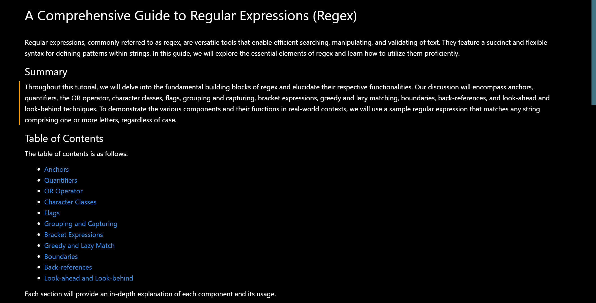

# RegTutorial

## Description
in this project we explain how to use regex what the system does what the symboles do what the  operators are

## 📝 Table of Contents
- <a href="#description">Description</a>
- <a href="#installation">Installation</a>
- <a href="#usage">Usage</a>
- <a href="#contributors">Contributors</a>
- <a href="#license">License</a>
- <a href="#questions">Questions</a>
- <a href="#tests">Tests</a>

## Usage
processing to search, match, and manipulate text based on patterns. The point of regex is to allow you to write patterns that can match and extract specific parts of text in a flexible and efficient way.

Here are a few reasons why regex is useful:

Searching: You can use regex to search for patterns in text, such as finding all instances of a certain word or phrase.

Validation: You can use regex to validate input, such as ensuring that an email address is in the correct format.

Data extraction: You can use regex to extract specific pieces of data from a larger text, such as parsing a log file to find relevant information.

Text manipulation: You can use regex to manipulate text, such as replacing all instances of a certain word with another word.

Regex is a powerful tool that can save a lot of time and effort when working with text data. While it can be complex to learn and use, once mastered, it can greatly improve text processing workflows.

## Contributors
Justin 

## Tests
NONE

## Questions
GITHUB: https://github.com/Activator95/

Contact Justinsemail12@yahoo.com

## License
This project is under MIT license
